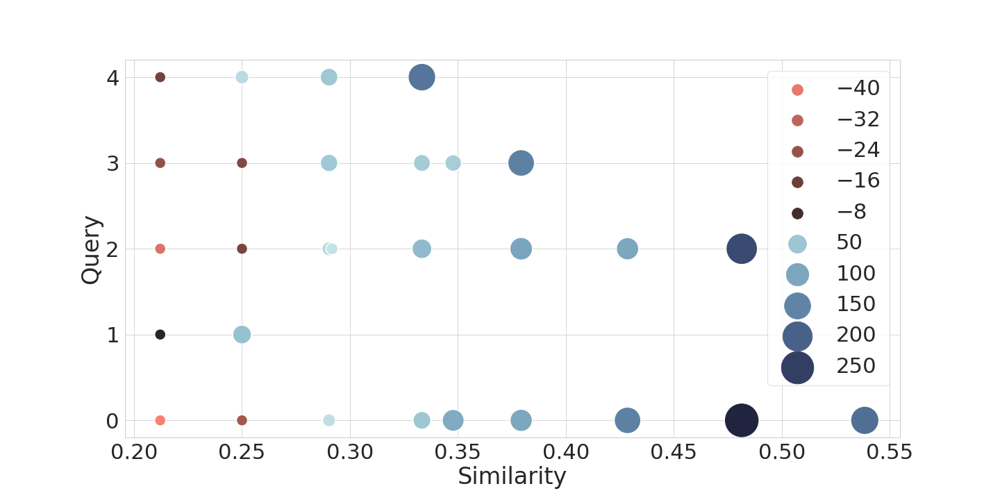

# Sampling a Near Neighbor in High Dimensions

This repository contains the source code and infrastructure code to reproduce the experiments in the paper `Sampling a Near Neighbor in High Dimensions --- Who is the Fairest of Them All?`.
It contains the code to automatically generate the inputs, run the experiments using different query LSH algorithms on top of LSH, and contains the whole evaluation provided as a Jupyter notebook.

## Reproduce experiments

Install required python packages by running `pip3 install --user -r requirements.txt`. Adapt the python paths in `run_exp.sh` (highly recommended to use pypy in the second part), run `run_exp.sh` and then `run_running_time_exp.sh`.

We provide a docker container with all requirements installed. It can be carried out by running the commands like so: `dockerrun bash run_exp.sh`.

The experiments will take around 1 day on a standard desktop machine. All experimental results will be stored in `exp-res`, and the plots can be generated by executing the Jupyter notebook `eval.ipynb`.

## Bias in a picture

The plot visualizes the bias that is present in uniform sampling approaches, relating the frequency of points reported if they the sampling were unbiased to the actual frequency observed by using LSH. 
There is a clear tendency that points with large similarity are overrepresented in the output.
Correcting this bias using the methods in the paper makes queries around 10x slower.
See our paper for more details. 

